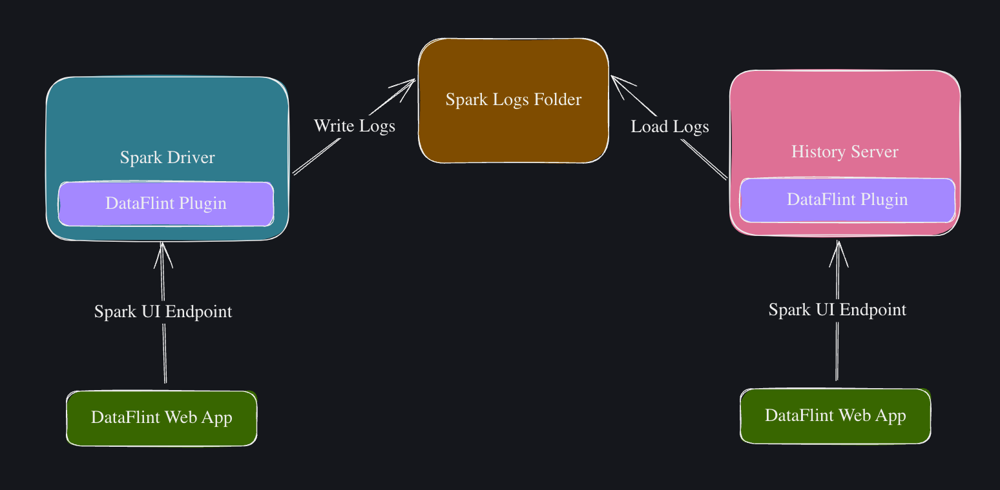

<p align="center">

</p>

<h2 align="center">
 Data-Application Performance Monitoring for data engineers
</h2>

<div align="center">

[](https://maven-badges.herokuapp.com/maven-central/io.dataflint/spark_2.12)
[](https://join.slack.com/t/dataflint/shared_invite/zt-28sr3r3pf-Td_mLx~0Ss6D1t0EJb8CNA)
[](https://github.com/your_username/your_repo/actions/workflows/tests.yml)
[](https://dataflint.gitbook.io/dataflint-for-spark/)


If you enjoy DataFlint please give us a ⭐️ and join our [slack community](https://join.slack.com/t/dataflint/shared_invite/zt-28sr3r3pf-Td_mLx~0Ss6D1t0EJb8CNA) for feature requests, support and more!

</div>

## What is DataFlint?

DataFlint is an open-source D-APM (Data-Application Performance Monitoring) for Apache Spark, built for big data engineers.

DataFlint mission is to bring the development experience of using APM (Application Performance Monitoring) solutions such as DataDog and New Relic for the big data world.

DataFlint is installed within minutes via open source library, working on top of the existing Spark-UI infrastructure, all in order to help you solve big data performance issues and debug failures!

## Demo


## Features

- 📈 Real-time query and cluster status
- 📊 Query breakdown with performance heat map
- 📋 Application Run Summary
- ⚠️ Performance alerts and suggestions
- 👀 Identify query failures
- 🤖 Spark AI Assistant

See [Our Features](https://dataflint.gitbook.io/dataflint-for-spark/overview/our-features) for more information

## Installation

### Scala

Install DataFlint via sbt:
```sbt
libraryDependencies += "io.dataflint" %% "spark" % "0.1.5"
```

Then instruct spark to load the DataFlint plugin:
```scala
val spark = SparkSession
    .builder()
    .config("spark.plugins", "io.dataflint.spark.SparkDataflintPlugin")
    ...
    .getOrCreate()
```

### PySpark
Add these 2 configs to your pyspark session builder:

```python
builder = pyspark.sql.SparkSession.builder
    ...
    .config("spark.jars.packages", "io.dataflint:spark_2.12:0.1.5") \
    .config("spark.plugins", "io.dataflint.spark.SparkDataflintPlugin") \
    ...
```

### Spark Submit

Alternatively, install DataFlint with **no code change** as a spark ivy package by adding these 2 lines to your spark-submit command:

```bash
spark-submit
--packages io.dataflint:spark_2.12:0.1.5 \
--conf spark.plugins=io.dataflint.spark.SparkDataflintPlugin \
...
```

### Usage

After the installations you will see a "DataFlint" button in Spark UI, click on it to start using DataFlint


### Additional installation options

* There is also support for scala 2.13, if your spark cluster is using scala 2.13 change package name to io.dataflint:spark_**2.13**:0.1.5
* For more installation options, including for **python** and **k8s spark-operator**, see [Install on Spark docs](https://dataflint.gitbook.io/dataflint-for-spark/getting-started/install-on-spark)
* For installing DataFlint in **spark history server** for observability on completed runs see [install on spark history server docs](https://dataflint.gitbook.io/dataflint-for-spark/getting-started/install-on-spark-history-server)
* For installing DataFlint on **DataBricks** see [install on databricks docs](https://dataflint.gitbook.io/dataflint-for-spark/getting-started/install-on-databricks)

## How it Works



DataFlint is installed as a plugin on the spark driver and history server.

The plugin exposes an additional HTTP resoures for additional metrics not available in Spark UI, and a modern SPA web-app that fetches data from spark without the need to refresh the page.

For more information, see [how it works docs](https://dataflint.gitbook.io/dataflint-for-spark/overview/how-it-works)

## Articles

[Fixing small files performance issues in Apache Spark using DataFlint](https://medium.com/@menishmueli/fixing-small-files-performance-issues-in-apache-spark-using-dataflint-49ffe3eb755f)

## Compatibility Matrix

DataFlint require spark version 3.2 and up, and supports both scala versions 2.12 or 2.13. 


| Spark Platforms           | DataFlint Realtime  | DataFlint History server |
|---------------------------|---------------------|--------------------------|
| Local                     |       ✅            |           ✅             |
| Standalone                |       ✅            |           ✅             |
| Kubernetes Spark Operator |       ✅            |           ✅             |
| EMR                       |       ✅            |           ✅             |
| Dataproc                  |       ✅            |           ❓             |
| HDInsights                |       ✅            |           ❓             |
| Databricks                |       ✅            |           ❌             |

For more information, see [supported versions docs](https://dataflint.gitbook.io/dataflint-for-spark/overview/supported-versions)